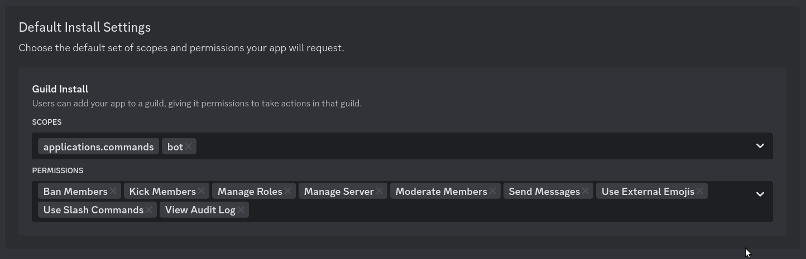
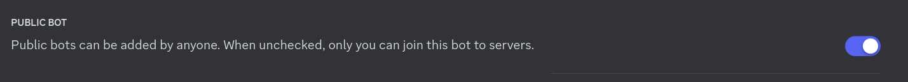
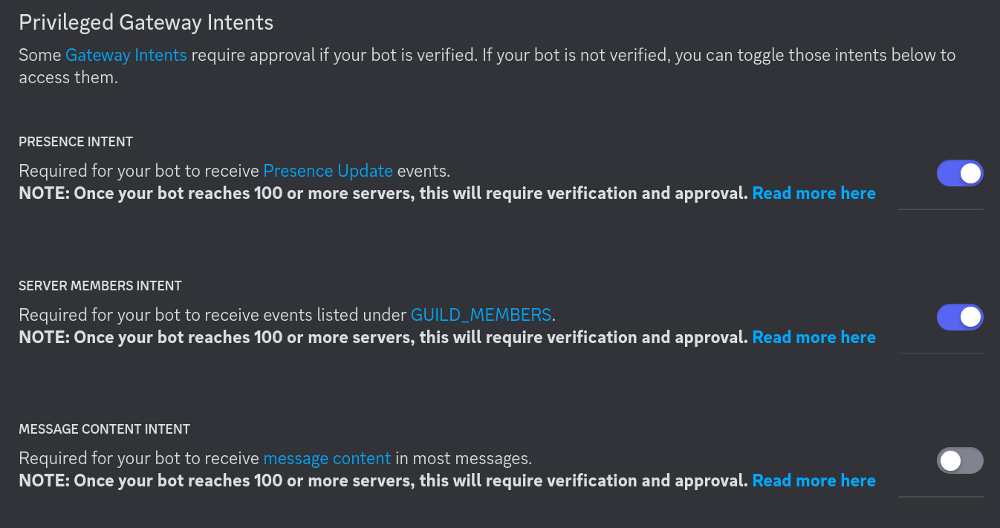

# Initialisation

1. Lancez la commande `make initialize`.

Votre arborescence de fichiers devrait à présent ressembler à ceci :

```
├── .env.example
├── .env
├── .env.test.example
├── .env.test
└── ...
```

2. Adaptez les fichiers d'environnement (`.env.test`, `.env`...) à vos besoins en vous basant sur les fichiers d'exemple fournis.
3. Récupérez le token du bot Discord et entrez-le dans votre fichier `.env` (i.e. : `BOT_TOKEN`)
4. Configurez les paramètres de votre bot tels que :

<p align="center"></p>
<p align="center"></p>
<p align="center"></p>

5. Lancez le projet avec la commande `docker compose up`
6. Vous pouvez aussi lancer l'environnement de dév en utilisant la commande `docker compose watch`
